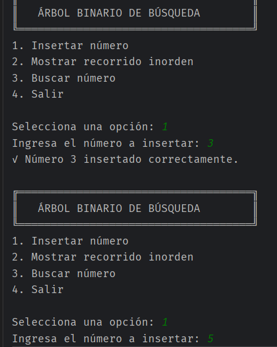
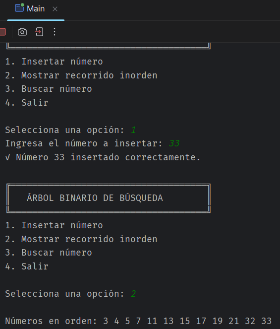
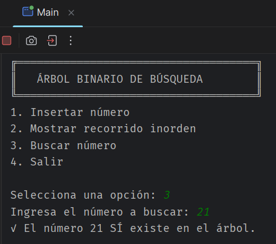
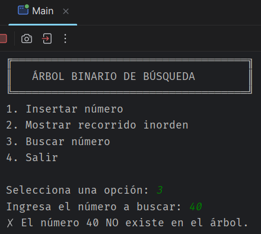

# Actividad - Arboles
- Diego Fernando Daza Ijaji 

## Qué es un Árbol Binario en Java

Un árbol binario es una estructura de datos en la que cada elemento, llamado nodo, puede tener como máximo dos hijos: uno izquierdo y uno derecho. En Java, se implementa creando una clase para representar los nodos, donde cada nodo contiene un valor (en este caso, un número entero) y referencias a sus hijos izquierdo y derecho. El árbol comienza con un nodo raíz, y los valores se organizan de manera que los menores van a la izquierda y los mayores a la derecha.

## Cómo se Implementó

La implementación se realizó en una sola clase llamada `Main.java`. Dentro de esta clase, se definió una clase interna `Nodo` para representar cada elemento del árbol, con atributos para el valor, el hijo izquierdo y el hijo derecho. Luego, se implementaron métodos para:

- **Insertar números**: Un método recursivo que compara el valor a insertar con el nodo actual y decide si colocarlo a la izquierda o derecha.
- **Mostrar recorrido inorden**: Un método que recorre el árbol en orden (izquierda, raíz, derecha), imprimiendo los valores en orden ascendente.
- **Buscar un número**: Un método recursivo que compara el valor buscado con el nodo actual y navega por el árbol hasta encontrarlo o determinar que no existe.

El programa principal permite al usuario interactuar por consola, insertando números, mostrando el inorden y buscando valores.

## Ejemplo de Ejecución en Consola

```
Bienvenido al Árbol Binario
1. Insertar número
2. Mostrar inorden
3. Buscar número
4. Salir
Elija una opción: 1
Ingrese el número a insertar: 5
Número insertado.

Elija una opción: 1
Ingrese el número a insertar: 3
Número insertado.

Elija una opción: 1
Ingrese el número a insertar: 7
Número insertado.

Elija una opción: 2
Recorrido inorden: 3 5 7

Elija una opción: 3
Ingrese el número a buscar: 5
El número 5 existe en el árbol.

Elija una opción: 3
Ingrese el número a buscar: 10
El número 10 no existe en el árbol.

Elija una opción: 4
Saliendo...
```

## Capturas de Pantalla

# Opción 1 - Insertar número


# Opción 2 - Mostrar recorrido inorden

# Opción 3 - Buscar número (Existente)

# Buscar número (No existente)


